# tmdb-movie-recommendation-system
<div align="center">

# 🎬 TMDB 电影数据分析与推荐系统

<p align="center">
  <strong>从数据下载 → 数据清洗 → 探索性分析 → 智能推荐 的全流程解决方案</strong>
</p>

<p align="center">
  
  
  
  
  
  
  
</p>

</div>

---

## 📋 项目概览

本项目基于 **TMDB 5000 电影数据集**，完成从数据获取到推荐系统构建的完整数据分析 Pipeline。项目共分为 **4个阶段**，产出 **3个可复现的 Jupyter Notebook**、**14张高清可视化图表**、**2份结构化Excel报告** 和 **1个完整的推荐系统模型**。

### 🎯 核心目标
| 目标 | 描述 |
|------|------|
| 🔄 数据自动化 | 自动下载TMDB数据集，支持断线重试 |
| 🧹 数据清洗 | 缺失值处理、异常值过滤、特征提取 |
| 📊 探索分析 | 14张专业图表 + 结构化分析报告 |
| 🤖 推荐系统 | 基于TF-IDF + 余弦相似度的内容推荐 |

---

## 🗂️ 项目结构

<pre>
电影数据分析与推荐系统/
├── 📂 <strong>原始数据/</strong>                 # 自动下载的原始数据集
│   ├── tmdb_5000_movies.csv           # 电影基本信息（4803部）
│   └── tmdb_5000_credits.csv          # 演职人员信息
├── 📂 <strong>处理后数据/</strong>
│   └── processed_movies.csv           # 清洗后的高质量数据（3226部）
├── 📂 <strong>代码文件/</strong>                  # Jupyter Notebook
│   ├── 📓 01_数据预处理.ipynb         # 阶段1：数据下载与预处理
│   ├── 📓 02_探索性数据分析.ipynb     # 阶段2：探索性数据分析
│   └── 📓 03_推荐系统构建.ipynb       # 阶段3：推荐系统构建
├── 📂 <strong>分析报表/</strong>
│   ├── 📊 电影数据分析报告.xlsx       # 5个工作表的综合报告
│   └── 📊 推荐系统效果验证.xlsx       # 5部电影推荐结果
├── 📂 <strong>可视化图表/</strong>               # 14张高清分析图表
├── 📂 <strong>模型文件/</strong>                  # 训练好的推荐模型
│   ├── similarity_matrix.pkl           # 相似度矩阵
│   └── movie_indices.pkl              # 电影索引映射
└── 📂 <strong>项目文档/</strong>
    ├── 项目总结.md                     # 详细项目总结
    ├── README.md                       # 本文件
    └── 简历项目描述.txt                # 简历版描述(200字)
</pre>

---

## 🚀 快速开始

### 环境准备
```bash
pip install pandas numpy matplotlib scikit-learn openpyxl requests jupyter
```

### 一键复现
按顺序执行以下Notebook即可复现全部结果：

```bash
# 阶段1：数据预处理
jupyter notebook "代码文件/01_数据预处理.ipynb"

# 阶段2：探索性数据分析
jupyter notebook "代码文件/02_探索性数据分析.ipynb"

# 阶段3：推荐系统构建
jupyter notebook "代码文件/03_推荐系统构建.ipynb"
```

> 💡 **提示**：也可以直接运行同名的 `.py` 脚本来快速生成结果。

---

## 🔍 分析成果展示

### 阶段1：数据预处理

| 清洗步骤 | 处理前 | 处理后 | 说明 |
|---------|-------|-------|------|
| 原始数据量 | 4803部 | 4803部 | 两个CSV文件合并 |
| 过滤无效数据 | 4803 | 3229 | 剔除budget/revenue<=0 |
| 过滤异常时长 | 3229 | **3226** | 保留60-300分钟 |
| 特征字段 | JSON格式 | 纯文本 | genres/cast/crew/keywords |
| 最终字段 | 24列 | **16列** | 精选核心字段 |

### 阶段2：探索性数据分析

#### 5大核心洞察

<details>
<summary><strong>📈 点击展开：电影产量年度趋势</strong></summary>

电影产量呈波动上升趋势，**2000年后产量显著增加**，2010-2015年达到高峰（年产量超200部），与全球电影市场快速扩张趋势一致。

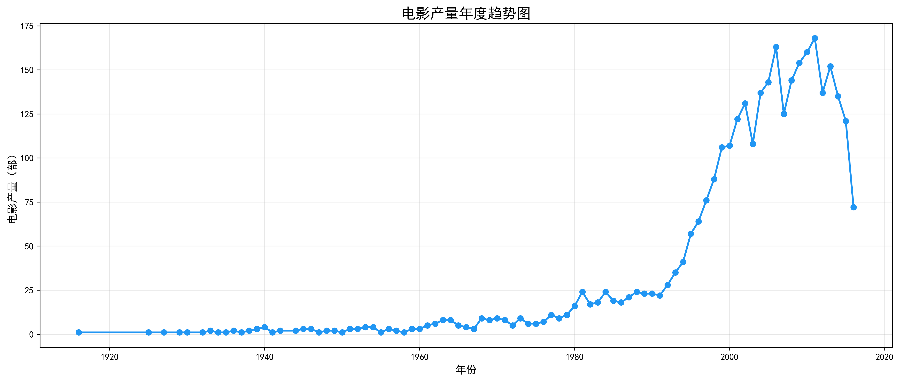

</details>

<details>
<summary><strong>💰 点击展开：预算与票房相关性</strong></summary>

预算与票房之间存在 **强正相关关系**（皮尔逊相关系数 **r=0.705**），高预算电影通常能获得更高票房，但散点图中存在明显离群点，说明投资回报并非线性关系。

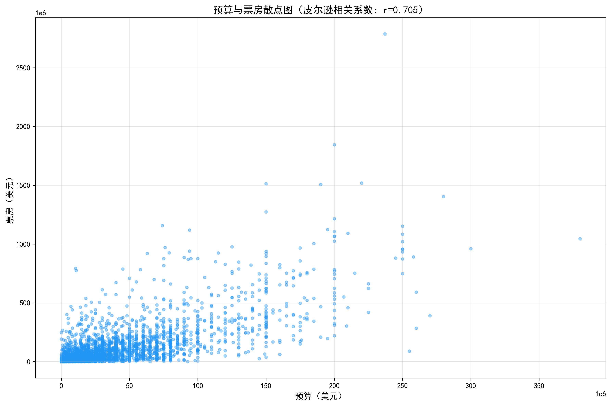

</details>

<details>
<summary><strong>🎭 点击展开：电影类型分布</strong></summary>

**剧情片（Drama）** 是出现最多的电影类型（**1440部**），远超其他类型。其次是喜剧片和惊悚片，说明观众对这三类有持续稳定需求。

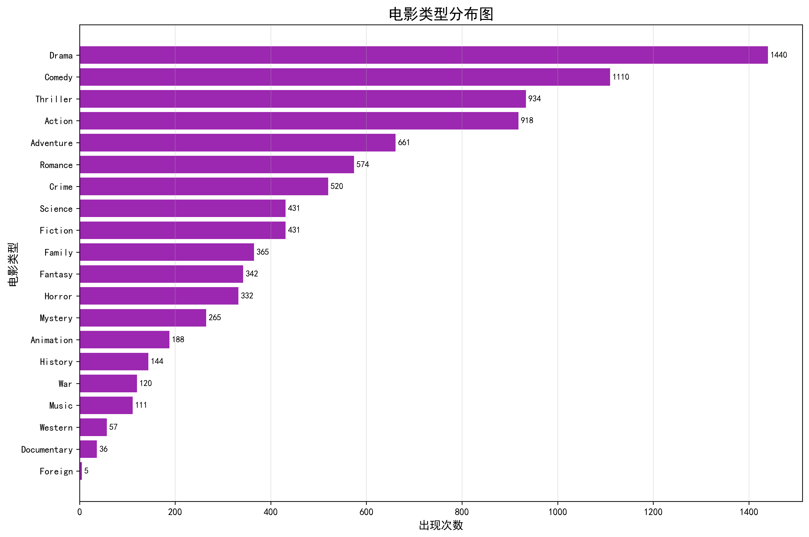

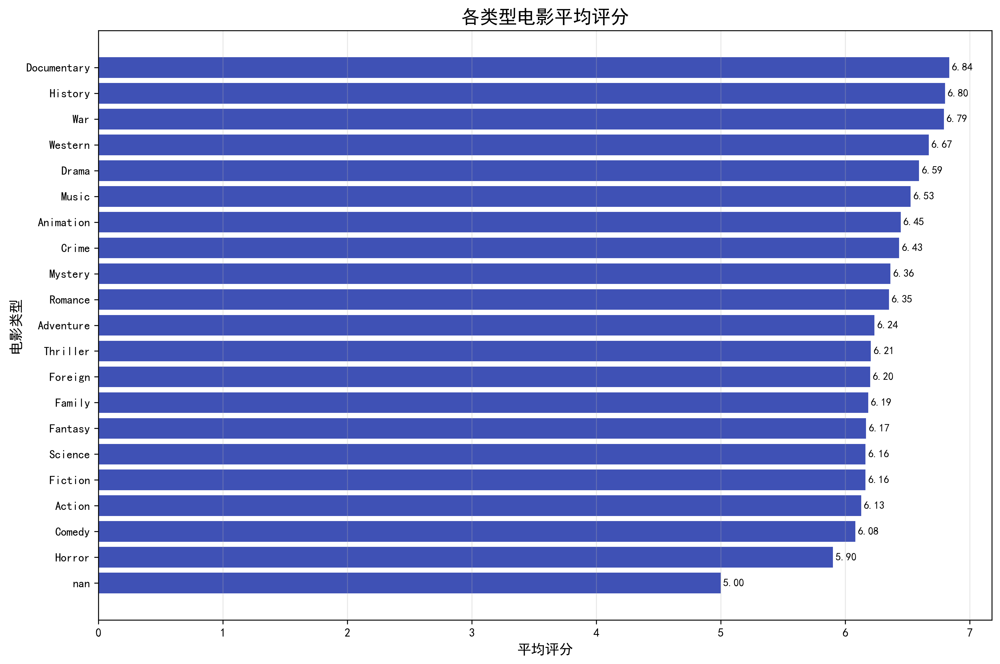

</details>

<details>
<summary><strong>⭐ 点击展开：评分分布</strong></summary>

评分呈 **正态分布**，平均评分 **6.31分**，大多数电影集中在6-7分之间，说明TMDB评分体系具有较好的区分度。

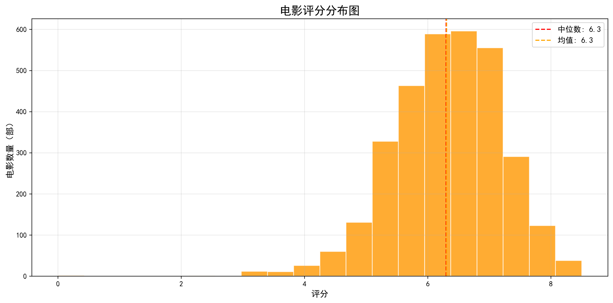

</details>

<details>
<summary><strong>🏆 点击展开：Top20高票房 vs 高评分电影</strong></summary>

票房Top1：《Avatar》| 评分Top1（投票>1000）：《The Shawshank Redemption》——叫好又叫座的电影才是真正的经典。

| Top20高票房电影 | Top20高评分电影 |
|:---:|:---:|
| 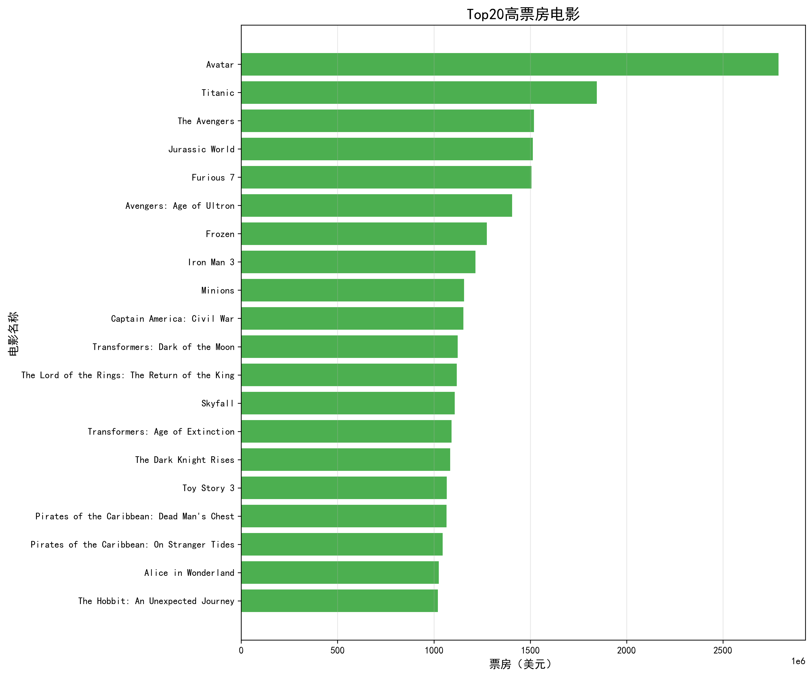 | 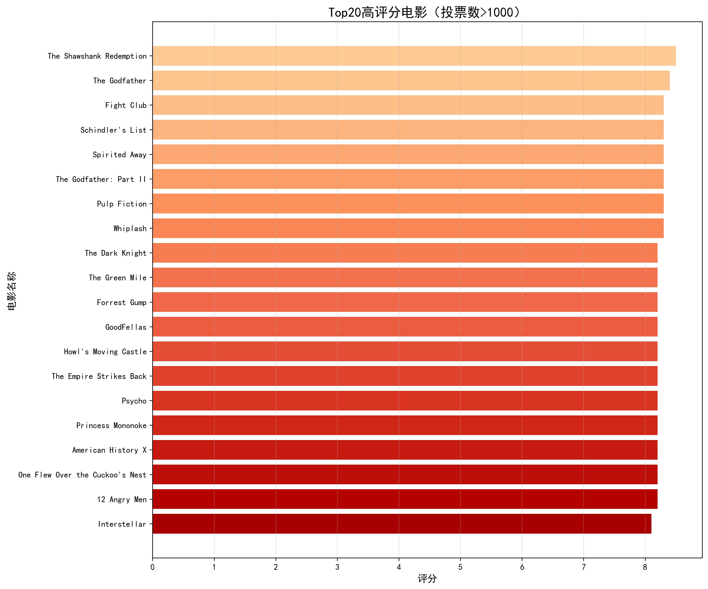 |

</details>

#### 📊 完整图表画廊

<div align="center">
  <table>
    <tr>
      <td align="center">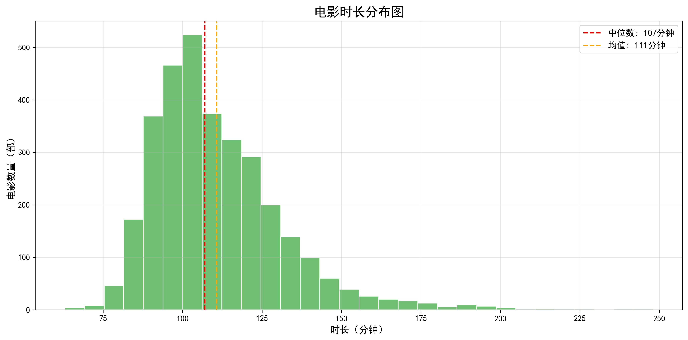<br>电影时长分布</td>
      <td align="center">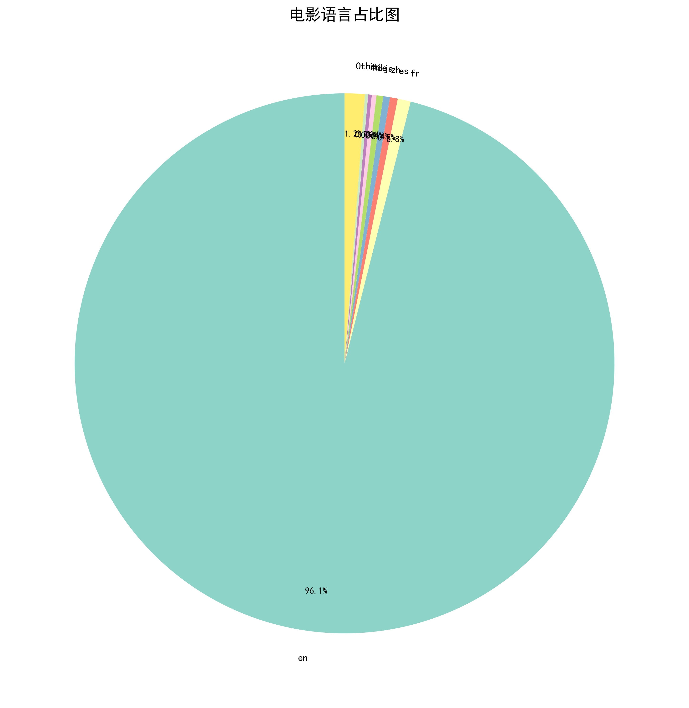<br>电影语言占比</td>
      <td align="center">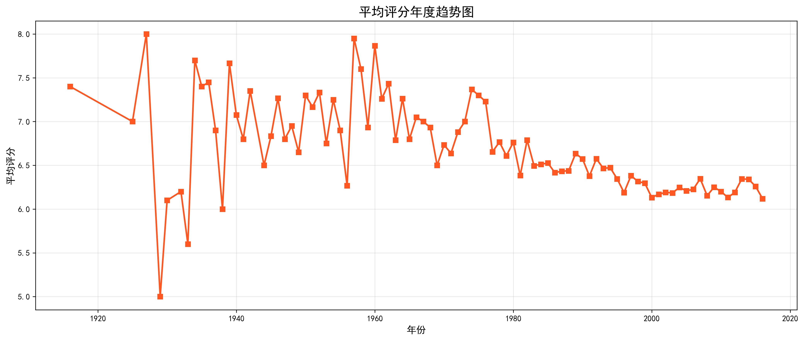<br>评分年度趋势</td>
    </tr>
    <tr>
      <td align="center">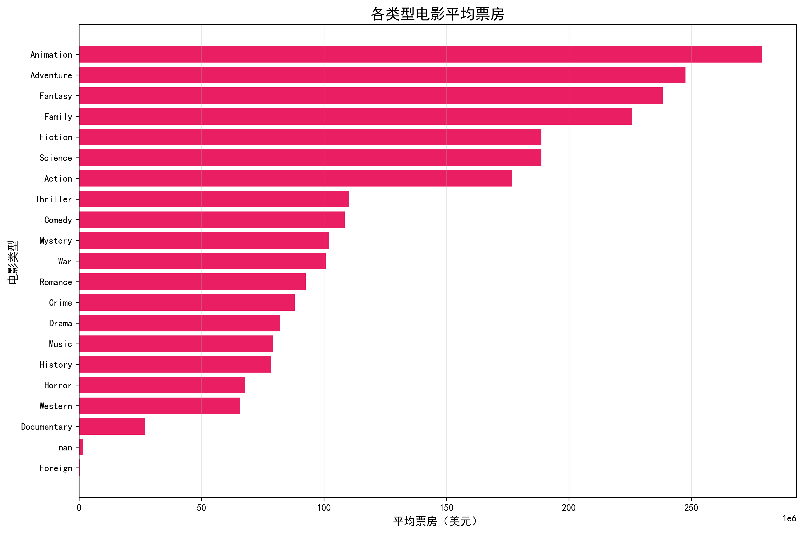<br>各类型平均票房</td>
      <td align="center">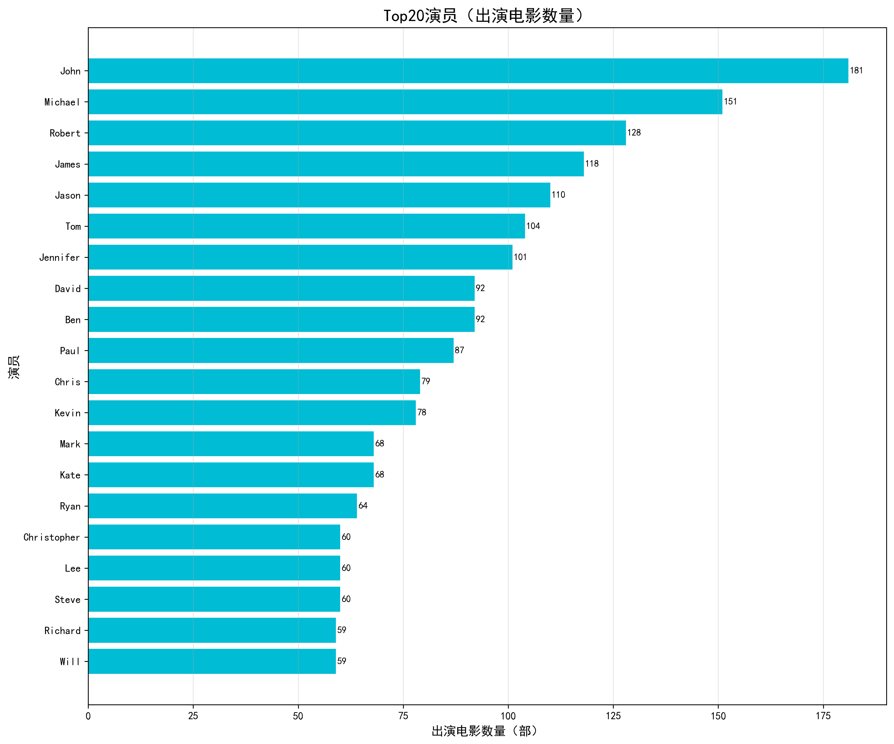<br>Top20演员</td>
      <td align="center">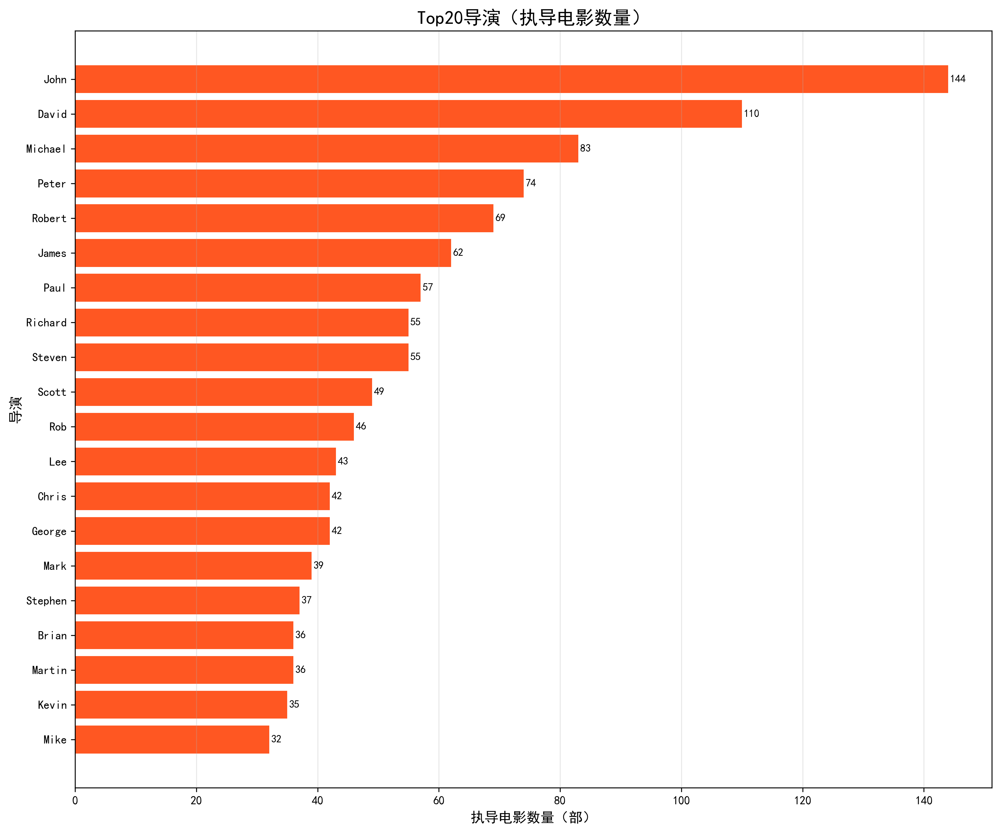<br>Top20导演</td>
    </tr>
  </table>
</div>

### 阶段3：推荐系统

#### 算法架构
```
用户输入电影标题
       ↓
  查找电影索引
       ↓
  TF-IDF特征向量化（5000维）
       ↓
  计算余弦相似度
       ↓
  排序 → 排除自身 → 返回Top-N
       ↓
  输出推荐结果（含评分、类型、导演、票房）
```

#### 推荐效果验证

| 输入电影 | Top3推荐 | 相似度 |
|---------|---------|:-----:|
| 🌀 Avatar | Aliens, Alien, Moonraker | 0.412~0.248 |
| 🦇 The Dark Knight | The Dark Knight Rises, Batman Begins, Batman Returns | 0.507~0.289 |
| 🚢 Titanic | Captain Phillips, Poseidon, Ghost Ship | 0.219~0.150 |
| 🌳 Forrest Gump | Journey from the Fall, The Deer Hunter, We Were Soldiers | 0.330~0.162 |
| 🔢 The Matrix | The Matrix Revolutions, The Matrix Reloaded, Jupiter Ascending | 0.580~0.172 |

---

## 🛠️ 技术栈

<div align="center">

| 类别 | 技术 | 用途 |
|:----|:----|:----|
| 🐍 语言 | Python 3 | 核心开发语言 |
| 📊 数据处理 | Pandas, NumPy | 数据清洗、特征工程 |
| 📈 可视化 | Matplotlib | 14张分析图表（300DPI） |
| 🤖 机器学习 | Scikit-learn | TF-IDF向量化、余弦相似度 |
| 📁 数据存储 | CSV, Excel, Pickle | 数据持久化、模型保存 |
| 📓 开发工具 | Jupyter Notebook | 可复现分析报告 |

</div>

---

## 📄 项目输出清单

| 文件 | 数量 | 说明 |
|:----|:---:|:----|
| 📓 Jupyter Notebook | 3个 | 各阶段完整代码+中文注释 |
| 📊 Excel分析报告 | 2份 | 数据分析报告+推荐效果验证 |
| 🖼️ PNG可视化图表 | 14张 | 300DPI高清，含标题/图例/标签 |
| 🤖 推荐模型文件 | 2个 | similarity_matrix.pkl + movie_indices.pkl |
| 📝 项目文档 | 3份 | 项目总结、README、简历描述 |

---

## 🔮 未来优化方向

- [ ] **混合推荐系统**：集成协同过滤算法，提升推荐多样性
- [ ] **NLP增强**：对overview进行情感分析和主题建模
- [ ] **交互式Dashboard**：使用Streamlit/Gradio构建Web应用
- [ ] **实时推荐**：扩展至Spark/Flink等分布式计算框架
- [ ] **冷启动优化**：引入元数据+内容特征的混合推荐策略

---

<div align="center">

**⭐ 如果这个项目对你有帮助，欢迎 Star！**

</div>
